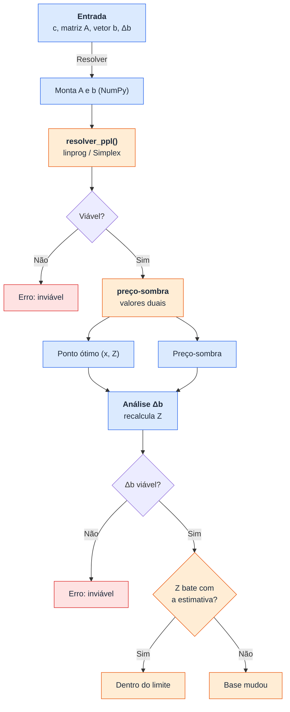

# Trabalho M210

| Nome                           | Matrícula | Curso |
|--------------------------------|-----------|-------|
| Marco Renzo Rodrigues Di Toro  | 150       | GES   |
| Kawan Dos Reis Brito           | 162       | GES   |
| Kauã Victor Garcia Siécola     | 1887      | GEC   |

--- 

- **Ponto ótimo de operação** (valor de cada variável e do Z ótimo)
- **Preço-sombra** de cada restrição
- Se as **variações desejadas (Δb)** são viáveis
- O **novo lucro ótimo** e o **limite de validade do preço-sombra**

## Rodando essa budega
```bash
pip install -r requirements.txt
streamlit run app.py
```

### Exemplo:
Máx Z = 3X + 5Y
- X ≤ 4
- 2Y ≤ 12
- 3X + 2Y ≤ 18

Resultado esperado: X=2, Y=6, Z=36, preços-sombra = (0, 1.5, 1)

---

### Fluxograma com mermaid:




---

### Descrição do trabalho:
> Desenvolver um código em Python para resolver um PPL com 2,3 ou 4 variáveis, usando o método Simplex Tableau. Deverá possuir uma entrada de dados amigável assim como uma saída. É permitido o uso de bibliotecas específicas de programação linear. A entrada de dados é composta pelos coeficientes da função objetivo e das restrições. Além das variações desejadas em cada restrição. A saída de dados deve conter o ponto ótimo de operação, o preço-sombra de cada restrição e se as alterações desejadas são viáveis. Caso as alterações sejam viáveis, apresentar o novo lucro ótimo e o limite de validade do preço-sombra. Deve ser desenvolvida uma interface gráfica (frontend) utilizando bibliotecas para este fim. Exemplo: streamlit, panel, gradio, etc.
