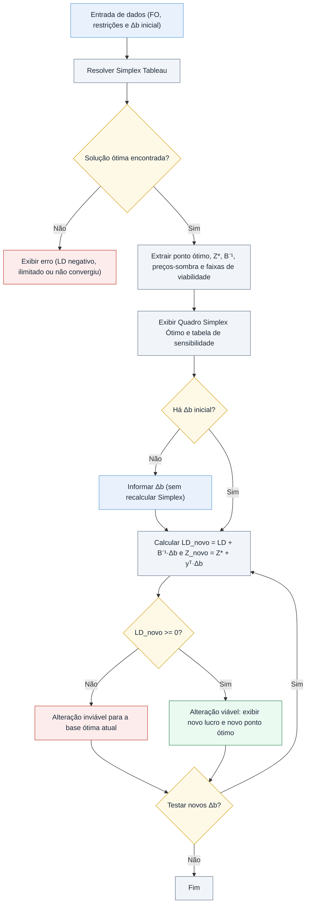

# Resolvedor de PPL [Simplex] [M210]

### Fluxo

```mermaid
flowchart TD
    A["Entrada de dados (FO, restrições e Δb inicial)"] --> B["Resolver Simplex Tableau"]
    B --> C{"Solução ótima encontrada?"}
    C -- "Não" --> D["Exibir erro (LD negativo, ilimitado ou não convergiu)"]
    C -- "Sim" --> E["Extrair ponto ótimo, Z*, B⁻¹, preços-sombra e faixas de viabilidade"]
    E --> F["Exibir Quadro Simplex Ótimo e tabela de sensibilidade"]
    F --> G{"Há Δb inicial?"}
    G -- "Não" --> N["Informar Δb (sem recalcular Simplex)"]
    N --> H["Calcular LD_novo = LD + B⁻¹·Δb e Z_novo = Z* + yᵀ·Δb"]
    G -- "Sim" --> H
    H --> I{"LD_novo >= 0?"}
    I -- "Não" --> K["Alteração inviável para a base ótima atual"]
    I -- "Sim" --> J["Alteração viável: exibir novo lucro e novo ponto ótimo"]
    K --> L{"Testar novos Δb?"}
    J --> L
    L -- "Não" --> M["Fim"]
    L -- "Sim" --> H

    classDef entrada fill:#e8f1fc,stroke:#5b9bd5,color:#1f2937
    classDef processo fill:#f1f5f9,stroke:#64748b,color:#1f2937
    classDef decisao fill:#fef9e7,stroke:#d4a017,color:#1f2937
    classDef sucesso fill:#eafaf1,stroke:#2e8b57,color:#1f2937
    classDef erro fill:#fdecec,stroke:#c0392b,color:#1f2937

    class A,N entrada
    class B,E,F,H,M processo
    class C,G,I,L decisao
    class J sucesso
    class D,K erro
```

### Integrantes

| Nome | Matrícula | Curso |
|---|---|---|
| Marco Renzo Rodrigues Di Toro | 150 | GES |
| Igor Nogueira Olvio | 1860 | GEC |
